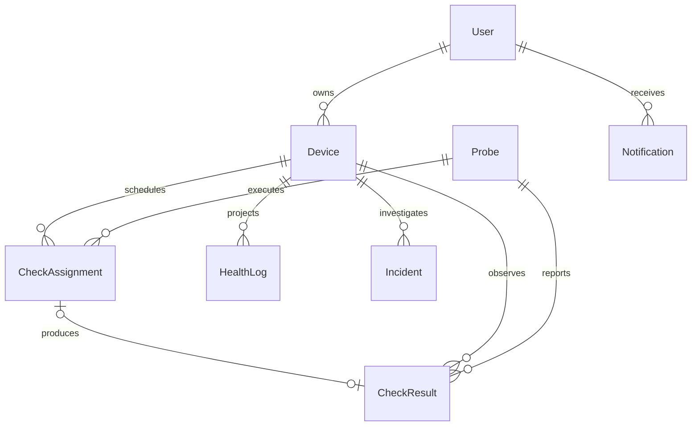

# Database workflow

`Device` is the stored name for an HTTP/HTTPS monitor. It belongs to a user and stores the schedule in seconds, request timeout and selected probe IDs/regions.



## Active records

- `Probe`: operator-managed execution location and hashed enrollment token; no CPU-agent collection.
- `CheckAssignment`: durable routine, confirmation or control work, with lease timestamps and attempts.
- `CheckResult`: source observation, linked to its monitor, probe and optional assignment. `kind` snapshots assignment purpose so controls remain distinguishable even after assignment removal. `isLate` keeps delayed observations out of live diagnosis.
- `HealthLog`: compatibility read projection for charts, analytics and reports. Only timely target observations create new rows. This table is still used and must not be removed as legacy data.
- `Incident`: verifier assessment, failure stage, evidence, affected locations and timeline.
- `ControlEndpoint`: operator-configured comparison target used by diagnostic follow-ups.
- User, token, preference, notification and audit models support authentication and operation of the console. Recovery notifications describe a return to health, not an automatic restart action.

## Legacy cleanup migrations

The October 6 cleanup removes `AgentMetric`, `Anomaly`, `SSLStatus`, `PortScanLog` and `RecoveryAction`, plus host discovery and obsolete AI incident fields. TLS report information now comes from probe results.

It also removes unsupported IP/server/worker monitor configurations, incidents without distributed assessments, associated/orphan incident notifications and retired recovery audit events. Old HealthLog rows are retained only when backed by a timely target CheckResult. User accounts, HTTP/API monitors and distributed observations remain.

**Back up existing databases before applying these data-destructive migrations.** For the local database, a pg_dump archive was created under the Git-ignored `.local-backups/` directory before cleanup. Backups contain private data and must not be committed.

Run from `Backend/`:

```bash
npx prisma migrate deploy
npx prisma generate
npx prisma migrate status
```

The historical migrations remain intact so an empty database can be built forward. Do not delete migration history or use `migrate reset` to upgrade an existing installation.

## Remaining design limits

Assignment claims and result processing still need stronger concurrent transaction guarantees. Selected probes and incident evidence use JSON rather than normalized relational tables. HealthLog duplicates some CheckResult fields; those writes are not yet one transaction. This cleanup aligns schema and current queries, but does not establish production concurrency correctness.
