# 🌐 NetScope | Enterprise Asynchronous Host Diagnostics & AI Incident Analysis Platform

**NetScope** is an enterprise-grade, developer-first health auditing and network diagnostics platform designed to continuously monitor web services, HTTP/HTTPS endpoints, TCP ports, and SSL certificates. 

Engineered with a **decoupled asynchronous architecture**, NetScope orchestrates concurrent latency sweeps and security audits via **BullMQ** and **Redis** background worker queues, persisting high-frequency diagnostic logs to a **PostgreSQL** relational database managed with **Prisma ORM**. It features an integrated **LLM-Powered AI Assistant** for real-time anomaly detection, automated root-cause analysis, and SLA compliance reporting.

---

## 🌟 Key Engineering & Architectural Highlights

- ⚡ **Asynchronous Distributed Auditing Pipeline:** Non-blocking background worker daemons decoupled from the main HTTP API server, processing concurrent network ping, port scan, and SSL verification jobs without blocking client request threads.
- 🤖 **AI-Driven Intelligent Diagnostics & Root Cause Analysis:** Integrated Google Gemini LLM prompting engine (`Backend/src/modules/ai`) that synthesizes health telemetry, error trends, and open port registries to deliver natural-language incident explanations and remediation recommendations.
- 🔐 **Enterprise Authentication & Session Security:** Complete JWT-based authentication system featuring short-lived access tokens, rotatable refresh token persistence (`RefreshToken` Prisma model), password hashing via `bcrypt`, user-scoped resource isolation, and detailed activity logs.
- 📊 **Real-Time Interactive Telemetry Dashboard:** Responsive single-page client built with React 19, Vite, and Tailwind CSS v4, featuring dynamic Chart.js latency visualizer graphs, live countdown worker indicators, and real-time status badges.
- 🔒 **Comprehensive Security & TLS Expiry Auditing:** Continuous monitoring of SSL/TLS certificate chains (validity windows, days remaining, issuers, fingerprints) and automated TCP socket port sweeps to identify unexpected exposed services.
- 📉 **Automated Incident Management & SLA Reporting Engine:** Tracks downtime incidents, calculates Mean Time to Repair (MTTR) and uptime availability ratios, and generates downloadable executive SLA summary reports in PDF and CSV formats.

---

## 🏗️ System Architecture & Workflow

NetScope enforces a clear separation of concerns across Client Rendering, REST API Routing, Intelligent AI Reasoning, and Distributed Worker Queues.

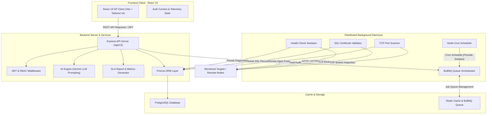
```mermaid
graph TD
    subgraph Client_Layer["Frontend Client - React 19"]
        ReactApp["React 19 SP Client (Vite + Tailwind v4)"]
        StateMgr["Auth Context & Telemetry State"]
    end

    subgraph API_Layer["Backend Server & Services"]
        ExpressAPI["Express API Server (/api/v3)"]
        AuthModule["JWT & RBAC Middleware"]
        AIService["AI Engine (Gemini LLM Prompting)"]
        ReportEngine["SLA Report & Metrics Generator"]
        PrismaClient["Prisma ORM Layer"]
    end

    subgraph Data_Tier["Cache & Storage"]
        Postgres["PostgreSQL Database"]
        Redis["Redis Cache & BullMQ Queue"]
    end

    subgraph Worker_Layer["Distributed Background Daemons"]
        Scheduler["Node-Cron Scheduler"]
        BullMQ["BullMQ Queue Orchestrator"]
        HealthWorker["Health Check Sweeper"]
        SSLWorker["SSL Certificate Validator"]
        PortWorker["TCP Port Scanner"]
    end

    ReactApp -->|"REST API Requests / JWT"| ExpressAPI
    ExpressAPI --> AuthModule
    ExpressAPI --> AIService
    ExpressAPI --> ReportEngine
    ExpressAPI --> PrismaClient
    PrismaClient --> Postgres
    
    ExpressAPI -->|"Dispatch Manual Audit"| BullMQ
    Scheduler -->|"Cron Schedule (Periodic Sweeps)"| BullMQ
    BullMQ <-->|"Job Queue Management"| Redis

    HealthWorker -->|"HTTP / HTTPS / Ping"| ExternalTargets["Monitored Targets / Remote Nodes"]
    SSLWorker -->|"TLS Socket Audit"| ExternalTargets
    PortWorker -->|"TCP Socket Inspection"| ExternalTargets

    HealthWorker -->|"Persist Diagnostics"| PrismaClient
    SSLWorker -->|"Persist SSL Records"| PrismaClient
    PortWorker -->|"Persist Open Ports"| PrismaClient
```

---

## 🚀 Core Features & Capabilities

### 1. 🤖 AI Assistant & Root-Cause Diagnostician
- **Telemetry-Aware Prompting:** Aggregates health status logs, latency spikes, response codes, and port registries to generate contextual prompts for LLM evaluation.
- **Intelligent Remediation Suggestions:** Provides targeted technical steps (e.g., DNS resolution check, SSL renewal, firewall adjustments) tailored to detected errors.
- **Resilient Fallback Mechanism:** Gracefully degrades to rule-based fallback summaries when external AI model endpoints are unreachable.

### 2. ⚡ Asynchronous Worker Queue & Latency Ledger
- **Multi-Protocol Monitoring:** Audits HTTP/HTTPS endpoints, REST APIs, and raw IP targets with configurable monitoring frequencies.
- **Concurreny & Rate Control:** Utilizes BullMQ queues backed by Redis to manage background audit tasks without starving server resources.
- **Live Worker Countdown:** Displays real-time scheduling countdowns and status indicators on the client dashboard.

### 3. 🔐 User Authentication & Access Governance
- **Session Security:** Short-lived JWT access tokens accompanied by server-managed, rotatable refresh tokens stored in PostgreSQL.
- **Multi-Tenant Data Isolation:** User-owned device registries ensuring strict data boundaries and user activity logging (`ActivityLog`).
- **Protected Routing:** Route guards and middleware for authenticated API access and secure client navigation.

### 4. 🔒 SSL Certificate Expiry Tracker & TCP Port Scanner
- **TLS Lifetime Monitoring:** Tracks validity start/end dates, issuer signatures, SHA fingerprints, and days remaining before certificate expiration.
- **Proactive Expiry Alerts:** Categorizes certificates into `VALID`, `EXPIRING`, `EXPIRED`, or `INVALID` states.
- **TCP Socket Scanner:** Audits target IP ranges and hostnames for open TCP ports to alert on unauthorized or exposed network services.

### 5. 📉 Incident Lifecycle & SLA Compliance Engine
- **Automated Incident Logging:** Detects outages instantly and logs open downtime incidents (`Incident` model). Automatically marks incidents as resolved upon service restoration.
- **Reliability Metrics:** Calculates precise uptime percentages, average latency, peak latency, and Mean Time to Repair (MTTR).
- **Executive Reporting:** Generates downloadable SLA compliance reports in PDF and CSV formats for executive summaries.

---

## 📸 System Screenshots

### 🌐 Public Product Landing Page
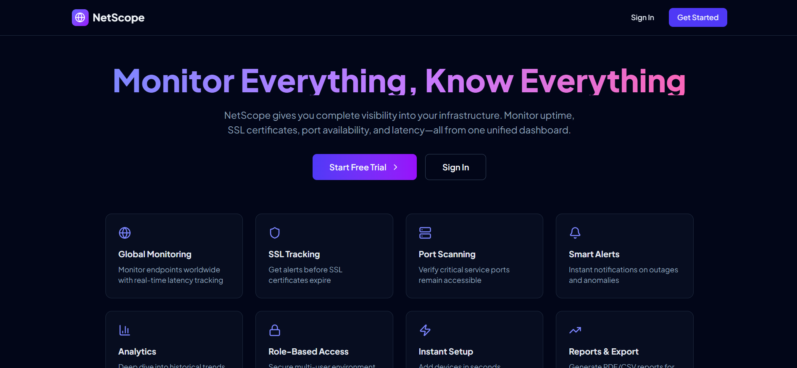

### 🔐 Authentication & Session Security Portal
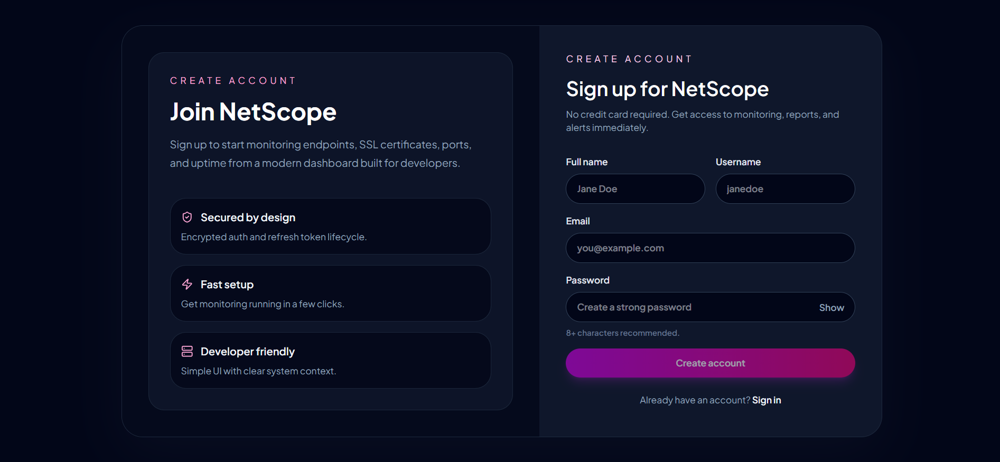

### 📊 Real-Time Network Telemetry & Executive Dashboard
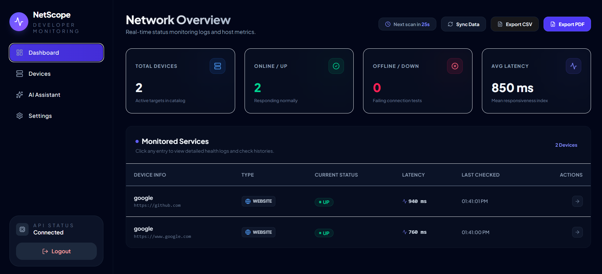

### 🤖 AI Assistant & Intelligent Network Diagnostician
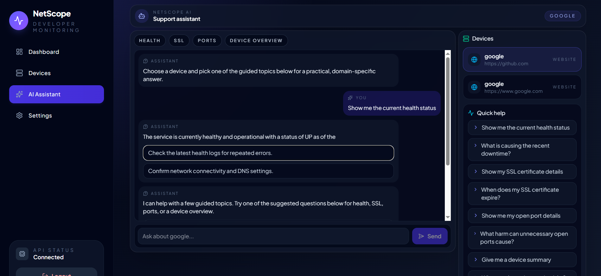

### 📱 Monitored Endpoint Registry & Device Management
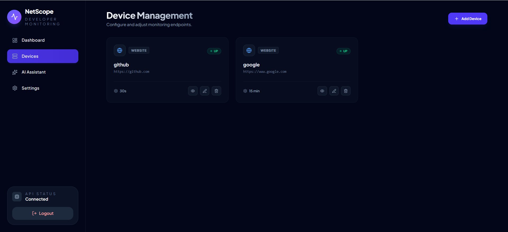

### 📈 Device Details - Latency Sweep Performance Curve
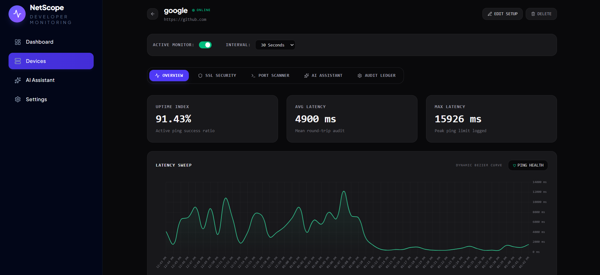

### 🔒 Device Details - SSL/TLS Security Certificate Diagnostics
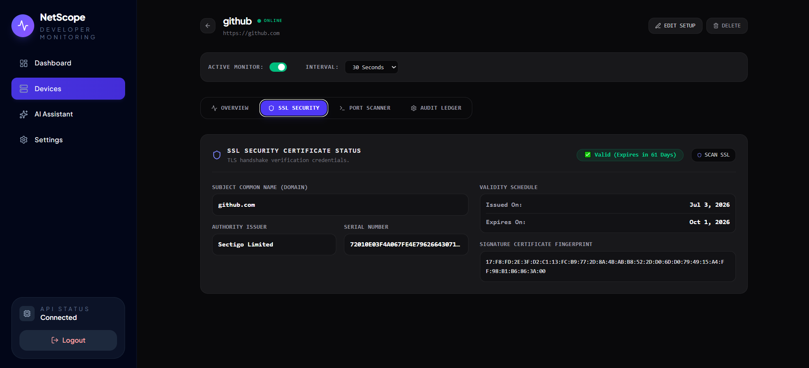

### 🔌 Device Details - TCP Port Scanner Registry
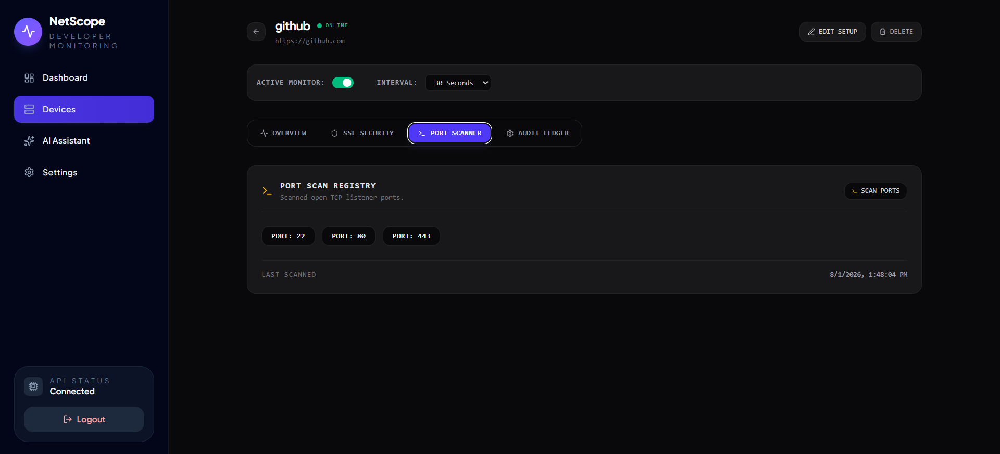

### 📜 Device Details - Health Audit History Ledger
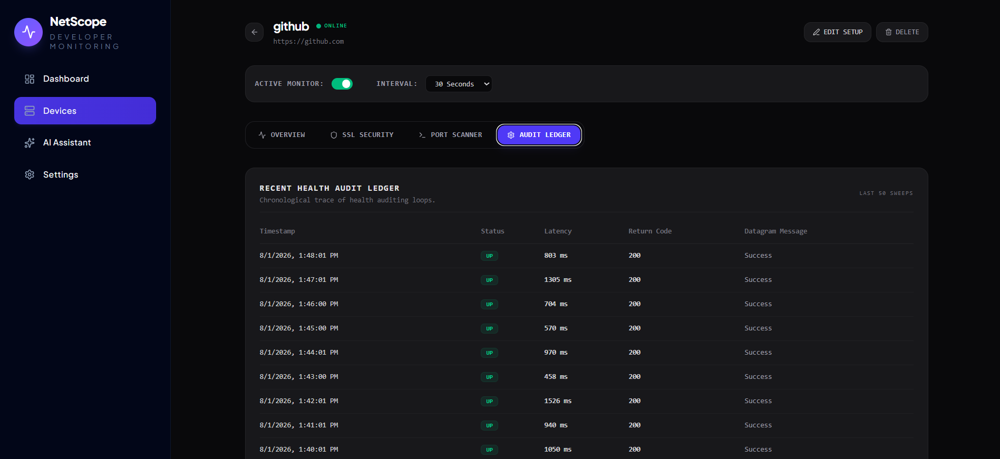

### 📄 Executive SLA Compliance & Automated Monitoring Report
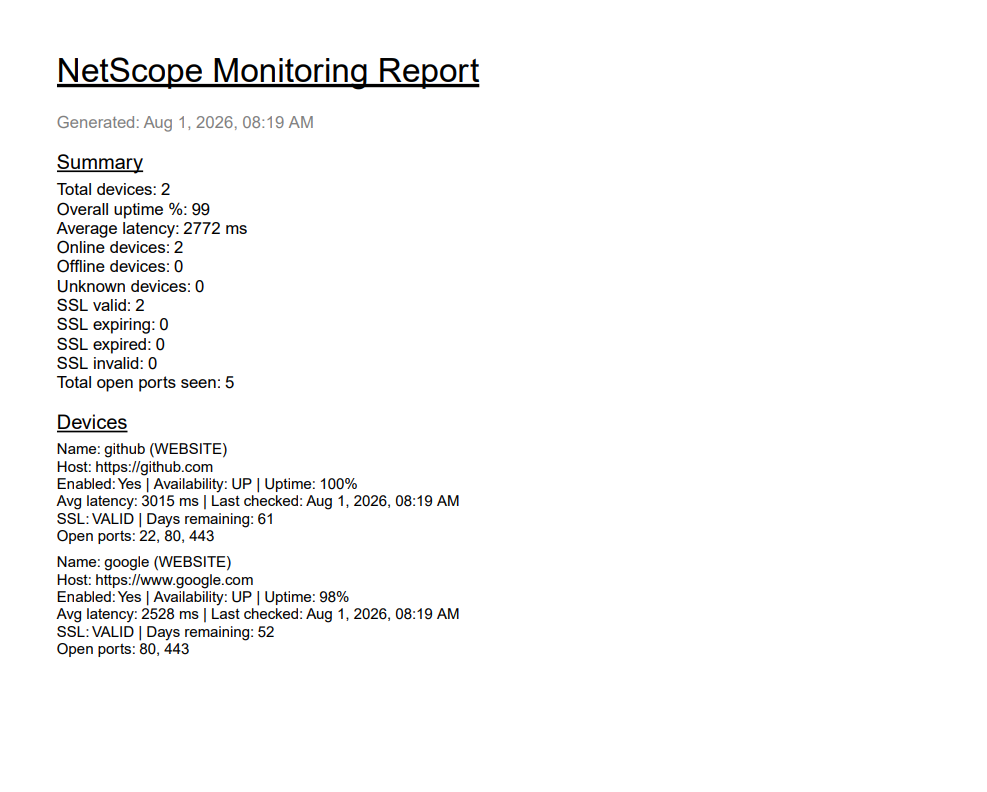

---

## 🛠️ Tech Stack & Engineering Specifications

| Tier | Technology | Purpose & Description |
| :--- | :--- | :--- |
| **Frontend** | **React 19**, Vite | Single-page interface built with modern React features and hooks |
| | **Tailwind CSS v4** | Dark-mode design system with responsive layouts and micro-animations |
| | **Chart.js** & `react-chartjs-2` | Canvas-rendered interactive latency performance visualizers |
| | **Lucide React** | Scalable vector icon library for technical UI components |
| **Backend** | **Node.js**, **Express.js** | Modular REST API server handling request validation, routing, and controller logic |
| | **Prisma ORM** | Type-safe database client and schema migration tool |
| | **BullMQ** & **Node-Cron** | Distributed job queue orchestration and periodic cron task scheduling |
| | **Google Gemini AI API** | Generative AI integration for automated system diagnostics and anomaly reasoning |
| **Database** | **PostgreSQL** | Relational data persistence for users, devices, health logs, SSL records, and incidents |
| **Cache & Queue** | **Redis** | In-memory data store providing job queue backend for BullMQ and execution state caching |

---

## 💾 Relational Database Schema

Managed seamlessly via Prisma ORM on PostgreSQL:

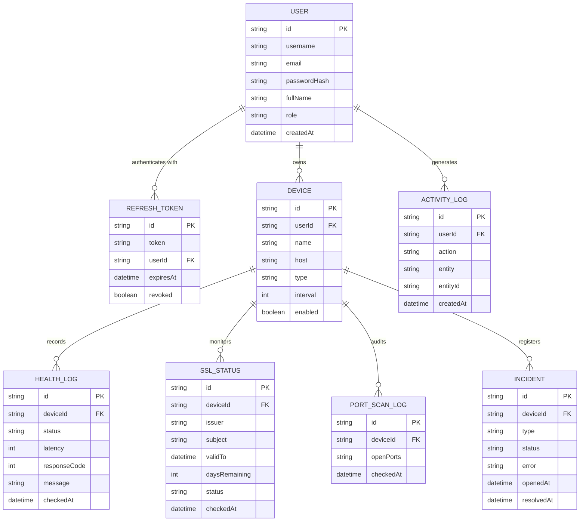
```mermaid
erDiagram
    USER ||--o{ REFRESH_TOKEN : "authenticates with"
    USER ||--o{ DEVICE : "owns"
    USER ||--o{ ACTIVITY_LOG : "generates"
    DEVICE ||--o{ HEALTH_LOG : "records"
    DEVICE ||--o{ SSL_STATUS : "monitors"
    DEVICE ||--o{ PORT_SCAN_LOG : "audits"
    DEVICE ||--o{ INCIDENT : "registers"

    USER {
        string id PK
        string username
        string email
        string passwordHash
        string fullName
        string role
        datetime createdAt
    }

    REFRESH_TOKEN {
        string id PK
        string token
        string userId FK
        datetime expiresAt
        boolean revoked
    }

    DEVICE {
        string id PK
        string userId FK
        string name
        string host
        string type
        int interval
        boolean enabled
    }

    HEALTH_LOG {
        string id PK
        string deviceId FK
        string status
        int latency
        int responseCode
        string message
        datetime checkedAt
    }

    SSL_STATUS {
        string id PK
        string deviceId FK
        string issuer
        string subject
        datetime validTo
        int daysRemaining
        string status
        datetime checkedAt
    }

    PORT_SCAN_LOG {
        string id PK
        string deviceId FK
        string openPorts
        datetime checkedAt
    }

    INCIDENT {
        string id PK
        string deviceId FK
        string type
        string status
        string error
        datetime openedAt
        datetime resolvedAt
    }

    ACTIVITY_LOG {
        string id PK
        string userId FK
        string action
        string entity
        string entityId
        datetime createdAt
    }
```

---

## 🔌 API Specification

All API endpoints are versioned under `/api/v3`.

### 🔐 Authentication & Session (`/api/v3/auth`)
- `POST /auth/register` - Create a new user account with hashed password credentials.
- `POST /auth/login` - Authenticate credentials and issue JWT access token & HTTP-only refresh token.
- `POST /auth/refresh` - Rotate refresh token and issue a new JWT access token.
- `POST /auth/logout` - Revoke current refresh token and clear active session.
- `GET /auth/me` - Retrieve authenticated user profile and permissions.

### 🤖 AI Diagnostics Engine (`/api/v3/ai`)
- `POST /ai/diagnose` - Request AI-driven root cause analysis and troubleshooting recommendations for a target device.
- `GET /ai/insights/:deviceId` - Retrieve cached AI incident insights and failure risk summary.

### 📱 Device Registry Management (`/api/v3/devices`)
- `GET /devices` - List all monitored hosts owned by the user.
- `POST /devices` - Register a new host (Website, API endpoint, or IP address) with custom frequency interval.
- `GET /devices/:id` - Retrieve complete configuration and target metadata for a single host.
- `PUT /devices/:id` - Modify device settings, target URL, or pause/enable monitoring.
- `DELETE /devices/:id` - Remove device configuration and cascade delete associated diagnostic logs.

### 💓 Health Audits & Latency (`/api/v3/health`)
- `GET /health/:deviceId` - Fetch historical health check telemetry (response codes, status, latency ms).
- `POST /health/check/:deviceId` - Dispatch an immediate manual health sweep job to the BullMQ worker queue.

### 🔒 SSL Certificate Diagnostics (`/api/v3/ssl`)
- `GET /ssl` - Retrieve current TLS certificate status summary across all monitored endpoints.
- `GET /ssl/:deviceId` - View historical SSL check logs and expiry trends for a specific device.
- `POST /ssl/check/:deviceId` - Dispatch an immediate manual TLS certificate audit job.

### 🔌 TCP Port Scanner (`/api/v3/ports`)
- `GET /ports` - Retrieve open TCP port registries across all monitored devices.
- `GET /ports/:deviceId` - Retrieve historical port scan logs for a target device.
- `POST /ports/check/:deviceId` - Trigger an immediate TCP port scanning background job.

### 📊 Analytics & SLA Metrics (`/api/v3/analytics` & `/api/v3/dashboard`)
- `GET /dashboard/summary` - Aggregate metrics (Total Devices, Online/Offline count, Global Avg Latency).
- `GET /analytics/:deviceId` - Detailed analytics breakdown (Uptime %, Peak Latency, MTTR, Outage count).

### 📄 Executive SLA Reports (`/api/v3/reports`)
- `GET /reports/summary` - Fetch SLA compliance metrics across customizable date ranges.
- `GET /reports/export/pdf` - Download executive SLA compliance summary report as a formatted PDF.
- `GET /reports/export/csv` - Export diagnostic logs and uptime datasets as CSV.

---

## ⚡ Engineering Best Practices & Performance Design

1. **Database Indexing:** Compound indexes on `(deviceId, checkedAt)` and single indexes on `userId` and `host` optimize high-frequency time-series queries and fast dashboard rendering.
2. **Asynchronous Non-Blocking Execution:** Heavy network socket operations (pinging endpoints, TLS handshakes, TCP port scanning) run inside isolated background workers (`Backend/src/workers`), preventing event-loop congestion on the main Express HTTP server.
3. **Graceful Service Resilience:** The AI module features fallback logic that ensures system dashboard uptime and diagnostic reports remain operational even if external LLM APIs experience downtime.
4. **Clean Domain-Driven Modular Structure:** Backend modules (`ai`, `auth`, `report`, `health`, `ssl`, `port`, `analytics`, `device`, `dashboard`) strictly separate routes, controllers, and services for maximum maintainability and testability.