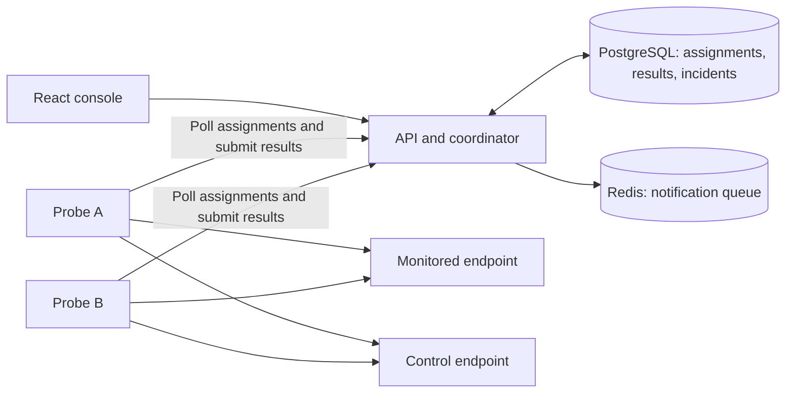

# NetScope

### Is the endpoint down, or is the observer having trouble?

NetScope checks HTTP/HTTPS endpoints from independently running probes, compares their observations, and gathers additional evidence before classifying an incident.

A failed request is an observation. Understanding where it failed is the engineering problem.

**Node.js · Express · PostgreSQL · Prisma · Redis · React · Docker**

[Quick start](#run-the-local-lab) · [Architecture](#how-it-works) · [Tests](#verification) · [Deployment](deploy/DEPLOYMENT_GUIDE.md)

## Why it exists

An endpoint can appear unavailable because its application failed, one network path is broken, DNS resolution failed, or the monitoring probe lost connectivity. A single health check cannot distinguish these cases.

NetScope combines target checks from multiple probes with control checks to help separate endpoint failures from observer failures. Its focus is the backend workflow: distributing work, tracking leases, accepting results safely, and turning observations into incident evidence.

## How it works


```mermaid
flowchart LR
    UI[React console] --> API[API and coordinator]
    API <--> DB[(PostgreSQL: assignments, results, incidents)]
    API --> Q[(Redis: notification queue)]
    PA[Probe A] -->|Poll assignments and submit results| API
    PB[Probe B] -->|Poll assignments and submit results| API
    PA --> T[Monitored endpoint]
    PB --> T
    PA --> C[Control endpoint]
    PB --> C
```

1. The coordinator creates durable check assignments in PostgreSQL.
2. Authenticated probes poll for work and receive time-limited leases.
3. Each probe records HTTP status, connection timings, failure stage, and available TLS evidence.
4. Abnormal observations trigger diagnostic follow-ups. The verifier compares target and control observations.
5. The console exposes probe observations, incident assessments, and check history.

Probes initiate connections to the coordinator; they do not need inbound application ports or direct database access. The active monitoring path does not require an LLM, a CPU collection agent, or automatic restarts of monitored services.

## What the code demonstrates

| Engineering area | Implementation |
| --- | --- |
| Distributed work | Database-backed assignments, lease expiry, bounded retry attempts |
| Result handling | Probe identity checks, duplicate result handling, late-result marking |
| Incident verification | Rule-based comparison of target and control observations |
| Network evidence | DNS, TCP, TLS and HTTP timings; structured failure stages |
| Access boundaries | User-scoped monitor and incident queries; operator probe management |
| Reproducible faults | Local HTTP target with healthy, outage, slow, flaky and location-labelled responses |

The classifier includes widespread failure, location-specific failure, suspected probe connectivity, DNS failure, TLS certificate failure, latency degradation, and insufficient evidence. These are assessments of observed symptoms, not proof of a root cause.

For example: if Probe A cannot reach a target, Probe B can, and A also fails its control check, the evidence suggests a problem with A's connectivity. If A's control succeeds, a target-specific path problem becomes more plausible.

## Run the local lab

Install Docker with Compose. From the repository root:

```bash
docker compose up --build -d
docker compose ps
```

| Service | Address |
| --- | --- |
| Web console | http://localhost:5173 |
| Coordinator API | http://localhost:5000/api/v3 |
| Fault target | http://localhost:9090/healthy |

The development stack runs database migrations and seeds an operator account:

- Email: `admin@netscope.internal`
- Password: `AdminPass123!`

These are public **local demo credentials**. The development Compose file also contains lab probe tokens and enables private lab network access. Do not expose this configuration to the internet.

Try monitoring `http://fault-target:9090/healthy`, `/outage`, `/slow`, or `/geo-blocked`. This hostname is reachable by the Compose probes; use `localhost:9090` only when opening the target from your host browser. Inspect the resulting per-probe evidence and incidents in the console.

**The two local probe containers share one machine and network. Their labels simulate locations; they are not evidence of a real multi-region deployment.**

Stop the stack while retaining its database:

```bash
docker compose down
```

## Verification

Install dependencies with `npm ci` in each package before running commands outside Docker.

```bash
cd Backend
npm test
cd ../probe
npm test
cd ../frontend
npm run lint
npm run build
```

Backend tests cover classifier fixtures, probe identity and result handling, query ownership, manual probe selection, and the backend SSRF helper. Probe tests separately exercise the remote runner. Several tests mock the database: passing them does not establish transactional safety under concurrent production traffic.

An additional local comparison harness is available:

```bash
node scripts/run_evaluation.js
```

See [evaluation scope](EVALUATION_REPORT.md). It uses local requests and simulated observations; its timings are not real distributed incident-confirmation latency or cloud benchmarks.

## Repository map

```text
Backend/       Management API, scheduler, verifier, persistence and tests
frontend/      React console and production Nginx configuration
probe/         Standalone polling probe and network check runner
fault_lab/     Controlled HTTP failure scenarios
scripts/       Local evaluation harness
deploy/        Deployment guide, Compose and draft Terraform templates
```

See the [database workflow and migration notes](Backend/prisma/README.md) for the active models and legacy-data cleanup.

## Deployment and current limits

The intended topology is one central host and probes on two independently hosted machines or regions. The [deployment guide](deploy/DEPLOYMENT_GUIDE.md) explains the boundaries and unfinished provisioning work.

- **Current status:** development prototype; cloud deployment and load capacity have not been established by this repository's tests.
- **Availability:** the central API and database are single points of failure. Persistent assignments do not make the coordinator highly available.
- **Security:** address filtering exists, but the backend helper and remote runner differ. Literal IPs, IPv6, DNS behaviour and redirect handling require further security review before public multi-tenant use.
- **Consistency:** concurrency, lease retries and recovery policy need end-to-end fault testing with real probes and PostgreSQL.
- **Evidence quality:** controls and independently hosted probes are necessary to make location comparisons meaningful. Labels alone provide no geographic assurance.
- **Infrastructure:** production Compose is a starting point. HTTPS termination, operator bootstrap, backups and remote probe provisioning need explicit setup; Terraform is a draft.

The project is designed to make these trade-offs inspectable, with reproducible local faults and source-level tests instead of unverified scale claims.
