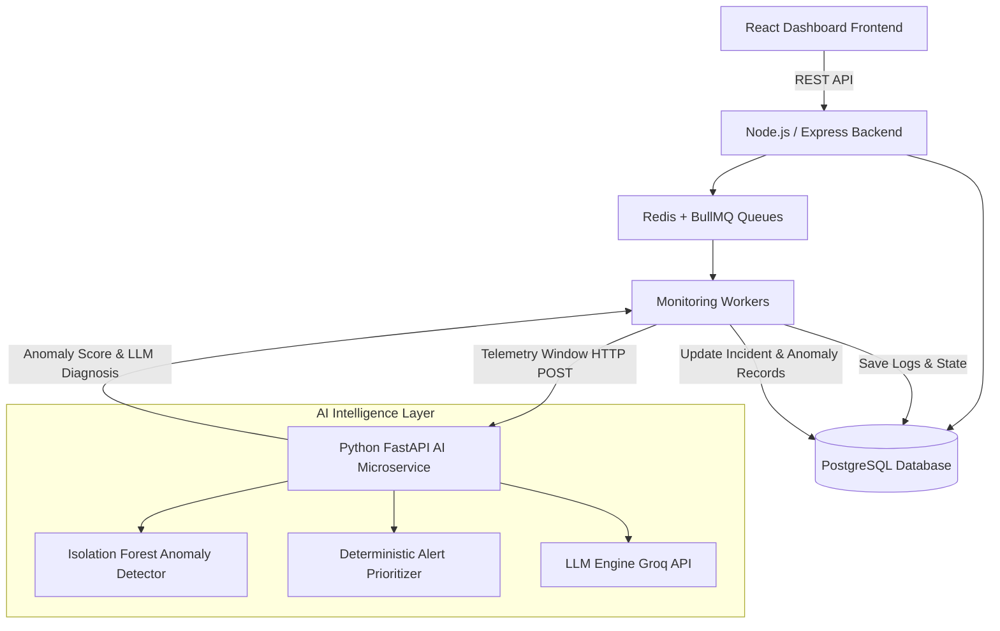

# NetScope — AI-Powered Infrastructure Observability Platform

NetScope (InfraScope) is a self-hosted, enterprise-ready infrastructure observability platform upgraded with an **AI Intelligence Layer**. It uses **scikit-learn Isolation Forest** for machine learning anomaly detection, **deterministic alert prioritization**, and **LLM structured incident analysis** (powered by Groq `openai/gpt-oss-20b` & `llama-3.3-70b`) to give SREs and DevOps teams instant root-cause clarity and automated CLI remediation playbooks.

---

## 📸 Application Screenshots & Visual Tour

### 1. Real-time Telemetry & Overview Dashboard

*Features high-density KPI cards, interactive Recharts latency area charts with gradient fill, device status breakdown donut, and real-time active monitor controls.*

---

### 2. Monitored Devices & Target Management

*Configure target websites, REST APIs, and IP addresses with custom check frequencies (30s to 60m), status indicators, and one-click manual diagnostic sweeps.*

---

### 3. AI Assistant & Telemetry Reasoning Engine

*Interactive generative AI console powered by Groq to analyze raw telemetry logs, SSL security validity, open TCP ports, and issue actionable fix recommendations.*

---

### 4. Incidents & Security Alerts Hub

*Prioritized infrastructure incidents with automated ML isolation forest anomaly scores, severity classification (`CRITICAL`, `HIGH`, `MEDIUM`), step-by-step incident progression timelines, and automated SRE CLI remediation playbooks.*

---

## 🏗️ Architecture Diagram


```mermaid
graph TD
    A[React Dashboard Frontend] -->|REST API| B[Node.js / Express Backend]
    B --> C[(PostgreSQL Database)]
    B --> D[Redis + BullMQ Queues]
    D --> E[Monitoring Workers]
    E -->|Save Logs & State| C
    E -->|Telemetry Window HTTP POST| F[Python FastAPI AI Microservice]
    
    subgraph AI Intelligence Layer
        F --> G[Isolation Forest Anomaly Detector]
        F --> H[Deterministic Alert Prioritizer]
        F --> I[LLM Engine Groq API]
    end
    
    F -->|Anomaly Score & LLM Diagnosis| E
    E -->|Update Incident & Anomaly Records| C
```

---

## 🛠️ Technology Stack

- **Frontend**: React, Vite, TailwindCSS, Recharts, Lucide Icons
- **Backend API**: Node.js, Express.js
- **Database & ORM**: PostgreSQL, Prisma ORM
- **Task Queue & Cache**: Redis, BullMQ
- **AI / ML Microservice**: Python 3.11, FastAPI, scikit-learn (Isolation Forest), NumPy, Pandas, Pydantic
- **LLM Engine**: Groq API (`openai/gpt-oss-20b` & `llama-3.3-70b-versatile` with sub-second inference & structured JSON mode)
- **Containerization**: Docker & Docker Compose

---

## 🤖 AI Features & Methodology

### 1. Isolation Forest Anomaly Detection
- **Algorithm**: `scikit-learn.ensemble.IsolationForest(n_estimators=100, contamination=0.15)`
- **Why Isolation Forest?**: Traditional monitoring relies on hardcoded thresholds (e.g. `latency > 500ms`), missing multi-metric anomalies (e.g. latency creep + 5xx error frequency). Isolation Forest isolates anomalies by randomly partitioning features. Anomalies require fewer tree splits because they are rare and distinct.
- **Engineered Features**:
  1. `latency`: Response duration in milliseconds
  2. `is_error`: Binary indicator (1 if status is DOWN or response code $\ge 400$, else 0)
  3. `error_rate`: Rolling average error ratio across recent checks
  4. `consecutive_failures`: Running count of contiguous failed checks
  5. `network_delay`: Combined network overhead (`dnsTime` + `tcpTime` + `tlsTime` + `ttfbTime`)
- **Score Normalization**: Maps decision function raw outputs to a $[0.0, 1.0]$ score, where $\ge 0.60$ is `HIGH` severity and $\ge 0.75$ is `CRITICAL`.

### 2. LLM Incident Analyzer & Playbook Generator
- **Structured Output**: Returns strict Pydantic/JSON schemas (`incident_summary`, `severity`, `observations`, `possible_causes`, `recommended_investigations`, `confidence`, `cli_commands`, `remediation_steps`).
- **Telemetry Grounding Rules**: Prompts strictly enforce that `observations` must contain observed facts from telemetry logs, while `possible_causes` are explicitly labeled as hypotheses to prevent hallucination.
- **Automated Remediation Playbooks**: Generates copyable CLI commands (`docker restart`, `kubectl rollout`, `systemctl status`, `curl`) for instant SRE recovery.

### 3. Deterministic Alert Prioritization
- **Scoring Formula**:
  $$\text{PriorityScore} = \text{BaseWeight} + (0.5 \times \text{ConsecutiveFailures}) + (4.0 \times \text{ErrorRate}) + (2.5 \times \text{AnomalyScore}) + (0.5 \times \text{DurationBoost})$$
- Scores map deterministically to `LOW`, `MEDIUM`, `HIGH`, and `CRITICAL`.

### 4. Interactive Telemetry Q&A Assistant
- Answers user inquiries conversationally in plain English while connecting explanations directly to monitored device telemetry.

---

## 🛡️ System Resilience & Fallback Design

> [!IMPORTANT]
> **Core Monitoring Resilience**
> If the Python AI microservice is down, times out (4000ms limit), or returns an error, the Node.js backend catches the error gracefully. Monitoring health checks, Redis status state machines, BullMQ jobs, and PostgreSQL logs continue running without interruption.

---

## 🗄️ Database Schema Highlights (`Backend/prisma/schema.prisma`)

- **`Device`**: Monitored targets (`id`, `name`, `host`, `type`, `interval`).
- **`HealthLog`**: Raw historical telemetry (`latency`, `dnsTime`, `tcpTime`, `tlsTime`, `ttfbTime`, `responseCode`, `status`, `checkedAt`).
- **`Anomaly`**: ML detection records (`anomalyScore`, `severity`, `detectionReason`, `metrics`, `timestamp`).
- **`Incident`**: Prioritized incidents with LLM diagnosis (`priority`, `priorityScore`, `summary`, `possibleCauses`, `recommendedActions`, `confidence`, `timeline`).

---

## 🚀 Setup & Running Instructions

### Local Development

1. **Start PostgreSQL & Redis**:
   ```bash
   docker compose up -d postgres redis
   ```

2. **Run Python AI Microservice**:
   ```bash
   cd ai_service
   python -m venv venv
   source venv/bin/activate  # or venv\Scripts\activate on Windows
   pip install -r requirements.txt
   uvicorn main:app --host 0.0.0.0 --port 8000
   ```

3. **Run Node.js Backend**:
   ```bash
   cd Backend
   npm install
   npx prisma generate
   npx prisma migrate dev
   npm run dev
   ```

4. **Run React Frontend**:
   ```bash
   cd frontend
   npm install
   npm run dev
   ```

### Docker Compose (Full Stack)

```bash
docker compose up --build
```
Access the application at `http://localhost:5173` and the AI Microservice OpenAPI docs at `http://localhost:8000/docs`.

---

## 📡 API Endpoints Summary

### Python AI Microservice (`http://localhost:8000`)
- `GET /health` — Microservice health status & Groq model config
- `POST /detect-anomaly` — Isolation Forest model inference
- `POST /analyze-incident` — LLM structured incident diagnosis
- `POST /prioritize-alert` — Deterministic priority score calculation
- `POST /summarize-timeline` — Incident timeline narrative generator
- `POST /generate-playbook` — Automated SRE CLI remediation playbook generator
- `POST /explain-insight` — Interactive telemetry Q&A explanation engine

### Node.js Backend API (`http://localhost:5000/api/v3`)
- `GET /api/v3/ai/anomalies` — Fetch recorded ML anomalies
- `GET /api/v3/ai/incidents` — Fetch prioritized active incidents
- `POST /api/v3/ai/incidents/:deviceId/analyze` — Trigger on-demand incident diagnosis
- `POST /api/v3/ai/playbook/:deviceId` — Generate SRE remediation playbook
- `GET /api/v3/ai/timeline/:deviceId` — Fetch timeline narrative summary